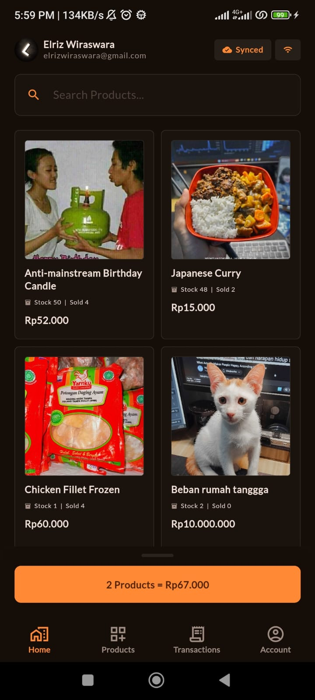
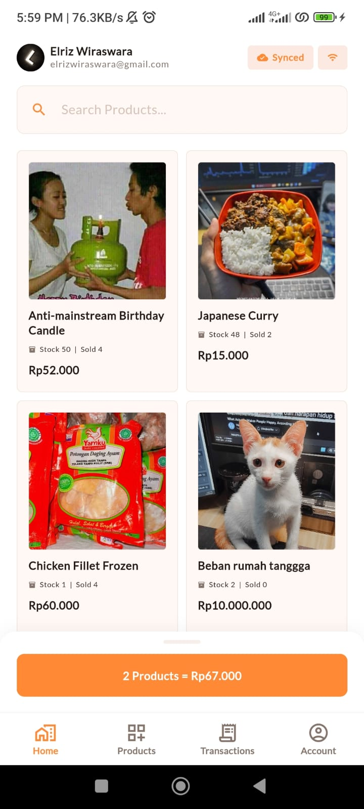
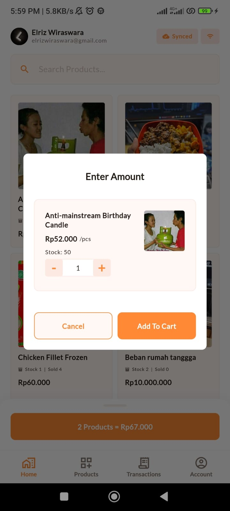
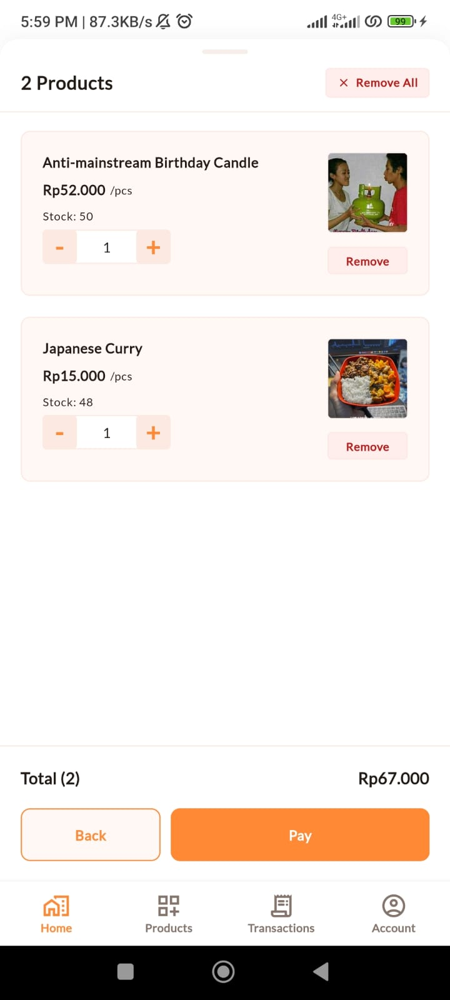
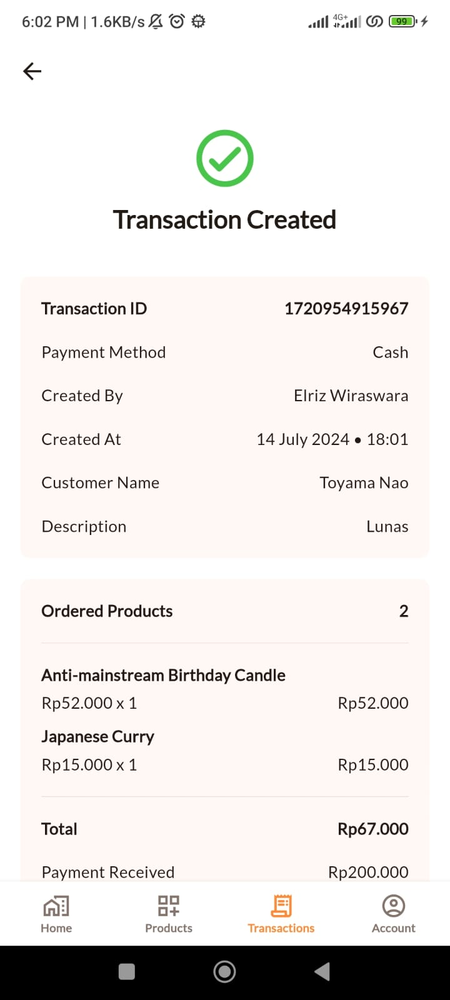
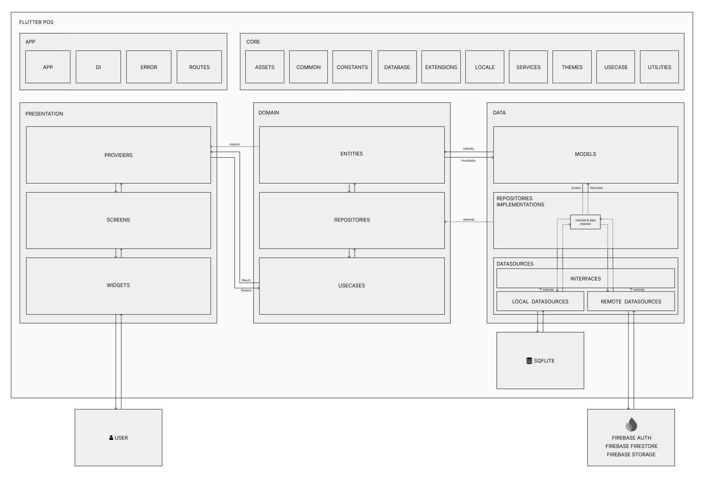

# Mono POS

[](./LICENSE)
[](https://flutter.dev/)

> 🚀 This project is the base model of [Zirel POS](https://zirelpos.com/). If you want a ready-to-use, feature-complete POS app, you might want to check it out, it's free, no card required.

A Point of Sale (POS) application built with Flutter, demonstrating **Clean Architecture** principles and **offline-first** design patterns. This project serves as a learning resource and reference implementation for building Flutter apps with proper architecture and automatic data synchronization between local storage (SQLite) and a cloud backend (Supabase Postgres).

The app prioritizes local-first operations, storing all data in SQLite and automatically syncing with Supabase when online. When offline, all user actions (create, update, delete) are recorded as `QueuedActions` in the local database and automatically executed in sequence when internet connectivity is restored.

<br/>
<p align="left">
  
  
  
  
  
</p>

## Demo APK

[Download Demo APK](https://github.com/monodev-id/MonoPOS/releases)

## Features

### Core Functionality

- **Product Management**: Full CRUD operations for products with image upload support, multi-unit definitions, and tiered (retail/grosir) pricing
- **Sales Transactions**: POS interface with cart management, per-item retail/grosir price selection, and transaction history
- **Thermal Receipt Printing**: Print transaction receipts via USB, Bluetooth, BLE, or network printers with configurable paper sizes (58mm, 72mm, 80mm)
- **Payments**: Integrated **KlikQRIS** QRIS payment gateway (sandbox + production) with webhook-based status confirmation
- **Customer Management**: Customer directory with forms integrated into the sales flow
- **Employee Management**: Role-based access control (admin / kasir) with employee accounts
- **Revenue Reporting**: Daily revenue reports filtered by paid status; admins can view across all users
- **User Authentication**: Supabase Auth with Google Sign-In and email/password
- **Account & Store Management**: User profile, store name/address/receipt footer settings, and printer settings
- **Localization**: Indonesian and English via `flutter_localizations` (ARB files)

### Technical Implementation

- **Offline-First Architecture**: Works seamlessly without internet connection
- **Automatic Data Sync**: SQLite ↔ Supabase (Postgres) bidirectional synchronization
- **Queued Actions**: Automatic retry mechanism for offline operations (create, update, delete)
- **Clean Architecture**: Separation between presentation, domain, and data layers
- **State Management**: Riverpod for safer, more testable state management
- **Dependency Injection**: Centralized DI setup for better code organization
- **Cloud Backend**: Supabase (Postgres + Auth + Storage) replacing Firebase/Firestore
- **Object Storage**: Product images and receipts stored via S3-compatible storage
- **Unit Testing**: Tests for datasources, repositories, and use cases
- **Material Design 3**: Material Design 3 with Dark & Light theme switching support
- **Customizable Theming**: Adjustable colors and typography
- **Multi-Platform**: Supports Android, iOS, Windows, macOS, and Linux
- **Error Handling**: User-friendly error messages and states
- **Reusable Widgets**: Custom UI components for consistent design

## Architecture



## Project Structure

```
mono_pos/
├── lib/
│   ├── app/                          # Application setup and configuration
│   │   ├── di/                       # Dependency injection
│   │   ├── error/                    # Error handling
│   │   └── routes/                   # App routing and navigation
│   │
│   ├── core/                         # Core utilities and shared resources
│   │   ├── assets/                   # Asset management
│   │   ├── common/                   # Common utilities (Result wrapper)
│   │   ├── constants/                # App constants
│   │   ├── extensions/               # Dart extensions
│   │   ├── locale/                   # Localization helpers
│   │   ├── services/                 # Core services
│   │   │   ├── connectivity/         # Network connectivity checking
│   │   │   ├── database/             # Local database service (sqflite)
│   │   │   ├── info/                 # Device info service
│   │   │   ├── logger/               # Error logging service
│   │   │   ├── payment/              # KlikQRIS payment service
│   │   │   ├── printer/              # Thermal printer service
│   │   │   ├── storage/              # S3-compatible object storage
│   │   │   ├── supabase/             # Supabase client config/service
│   │   │   └── sync/                 # Sync / queued-action processing
│   │   ├── themes/                   # App theming (colors, sizes, themes)
│   │   ├── usecase/                  # Base usecase interface
│   │   └── utilities/                # Helper utilities (formatters, loggers, etc.)
│   │
│   ├── data/                         # Data layer
│   │   ├── datasources/              # Data sources
│   │   │   ├── interfaces/           # Datasource interfaces
│   │   │   ├── local/                # Local datasources (sqflite)
│   │   │   └── remote/               # Remote datasources (Supabase, Auth, Storage)
│   │   ├── models/                   # Data models with JSON serialization
│   │   └── repositories/             # Repository implementations
│   │
│   ├── domain/                       # Domain layer (Business logic)
│   │   ├── entities/                 # Business entities
│   │   ├── repositories/             # Repository interfaces
│   │   └── usecases/                 # Use cases (business logic operations)
│   │
│   ├── presentation/                 # Presentation layer (UI)
│   │   ├── providers/                # State management (Riverpod)
│   │   │   ├── account/              # Account & store settings state
│   │   │   ├── auth/                 # Authentication state
│   │   │   ├── customer/             # Customer management state
│   │   │   ├── employees/            # Employee / RBAC state
│   │   │   ├── home/                 # Home screen state
│   │   │   ├── language/             # Localization state
│   │   │   ├── main/                 # Main navigation state
│   │   │   ├── payment/              # KlikQRIS payment state
│   │   │   ├── products/             # Products management state
│   │   │   ├── revenue/              # Revenue reporting state
│   │   │   ├── splash/               # Splash state
│   │   │   ├── theme/                # Theme state
│   │   │   └── transactions/         # Transactions state
│   │   ├── screens/                  # UI screens
│   │   │   ├── account/              # Account, store & printer settings, About
│   │   │   ├── auth/                 # Authentication screens
│   │   │   ├── customer/             # Customer screens
│   │   │   ├── employees/            # Employee management screens
│   │   │   ├── error/                # Error screens
│   │   │   ├── home/                 # Home/POS screen
│   │   │   ├── main/                 # Main navigation screen
│   │   │   ├── payment/              # KlikQRIS payment screen
│   │   │   ├── products/             # Product management screens
│   │   │   ├── revenue/              # Revenue report screens
│   │   │   ├── splash/               # Splash screen
│   │   │   └── transactions/         # Transaction history screens
│   │   └── widgets/                  # Reusable UI components
│   │
│   ├── l10n/                         # Localization ARB files (app_en, app_id)
│   ├── firebase_options.dart         # (legacy) Firebase configuration
│   └── main.dart                     # App entry point
│
├── test/                             # Unit and widget tests
│   ├── core/services/                # Service tests
│   ├── data/                         # Data layer tests
│   │   ├── datasources/              # Datasource tests
│   │   └── repositories/             # Repository tests
│   ├── domain/usecases/              # Usecase tests
│   └── presentation/screens/         # Screen tests
│
├── assets/                           # Static assets
├── android/                          # Android platform files
├── ios/                              # iOS platform files
├── linux/                            # Linux platform files
├── macos/                            # macOS platform files
├── web/                              # Web platform files
├── windows/                          # Windows platform files
├── supabase/                         # Supabase config & edge functions
│
├── analysis_options.yaml             # Dart analyzer configuration
├── pubspec.yaml                      # Package dependencies
└── README.md                         # Project documentation
```

## Getting Started

### Prerequisites

- [Flutter](https://flutter.dev/docs/get-started/install)
- [Dart](https://dart.dev/get-dart)
- A [Supabase](https://supabase.com/) project for the cloud backend

### Installation

1. **Clone the repository:**

   ```sh
   git clone https://github.com/monodev-id/MonoPOS.git
   cd MonoPOS
   ```

2. **Install dependencies:**

   ```sh
   flutter pub get
   ```

3. **Set up Supabase:**
   - Create a new project on [Supabase](https://supabase.com/).
   - The local SQLite schema (see [`DATABASE.md`](DATABASE.md)) mirrors the remote Postgres tables. Create matching tables in your Supabase project, or let the sync layer populate them after first run.
   - Enable the **Google** auth provider and configure the OAuth redirect/callback.
   - (Optional) Configure Row Level Security so that rows are scoped to the authenticated user.

4. **Set up your `config.json` file**

   The app reads its backend configuration from compile-time environment variables via `--dart-define-from-file`. Create a `config.json` in the project root:

   ```json
   {
     "SUPABASE_URL": "https://your-project.supabase.co",
     "SUPABASE_PUBLISHABLE_KEY": "your-publishable-anon-key",
     "GOOGLE_SERVER_CLIENT_ID": "xxxxx.apps.googleusercontent.com"
   }
   ```

   | Key | Description |
   | --- | --- |
   | `SUPABASE_URL` | URL of your Supabase project |
   | `SUPABASE_PUBLISHABLE_KEY` | Supabase anon/publishable key (legacy alias: `SUPABASE_ANON_KEY`) |
   | `SUPABASE_SECRET_KEY` | Optional service-role key for privileged server tasks |
   | `GOOGLE_SERVER_CLIENT_ID` | Web client ID from the Google Sign-In provider in Supabase |

   If `Supabase` is not configured, the app still runs fully offline — sync and remote features are disabled automatically.

5. **Run the application:**

   ```sh
   flutter run --dart-define-from-file config.json
   ```

### Test

To test the application, run the following command:

```sh
flutter test --coverage
```

To view the test coverage you can use `genhtml` or [test_cov_console](https://pub.dev/packages/test_cov_console)

## Payments (KlikQRIS)

Mono POS integrates [KlikQRIS](https://klikqris.id/) for QRIS-based payments. The payment flow:

1. The POS creates an invoice via the `KlikQRIS` service and displays the QR code on the `KlikQrisPaymentScreen`.
2. The user pays with any QRIS-compatible e-wallet/bank app.
3. A webhook worker (edge function) confirms payment status and the transaction is marked paid.

KlikQRIS credentials (`klikqris_api_key`, `klikqris_merchant_id`, `klikqris_is_sandbox`) are configured in the payment settings screen and stored locally.

## AI Agent Guidelines

This project includes documentation files designed for AI coding agents (e.g., Claude Code) to keep code consistent when modifying the project:

- [`CLAUDE.md`](CLAUDE.md) — Project conventions (architecture, naming, code style)
- [`UI.md`](UI.md) — UI reference (layouts, components, design specs)
- [`DATABASE.md`](DATABASE.md) — Database schema reference (tables, columns)
- [`WORKFLOW.md`](WORKFLOW.md) — Git workflow (commits, branches, PRs)
- [`WORKFLOW_SYSTEM.md`](WORKFLOW_SYSTEM.md) — Workflow/sync system reference
- [`SYNC.md`](SYNC.md) — Offline-first sync architecture

## Contributing

Contributions are welcome! Please open an issue or submit a pull request for any bugs, feature requests, or improvements.

## License

This project is licensed under the MIT License - see the [LICENSE](LICENSE) file for details.
